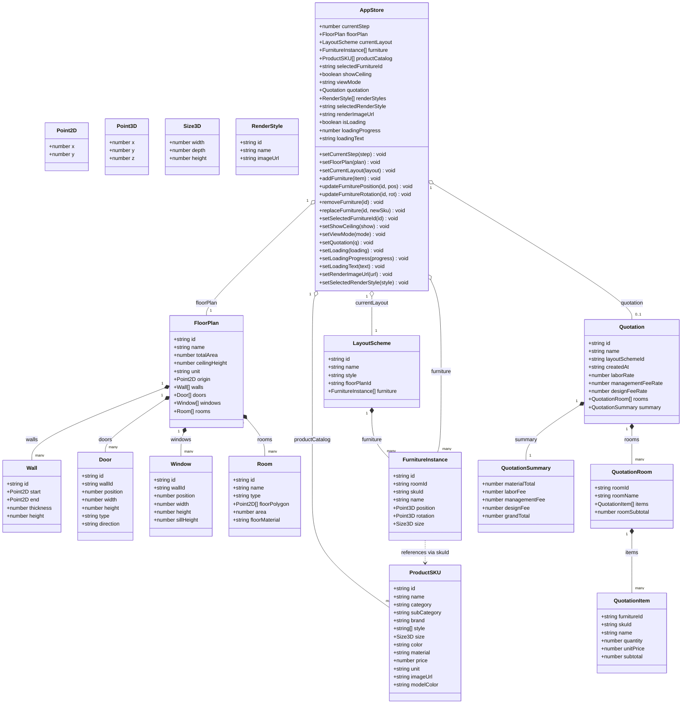
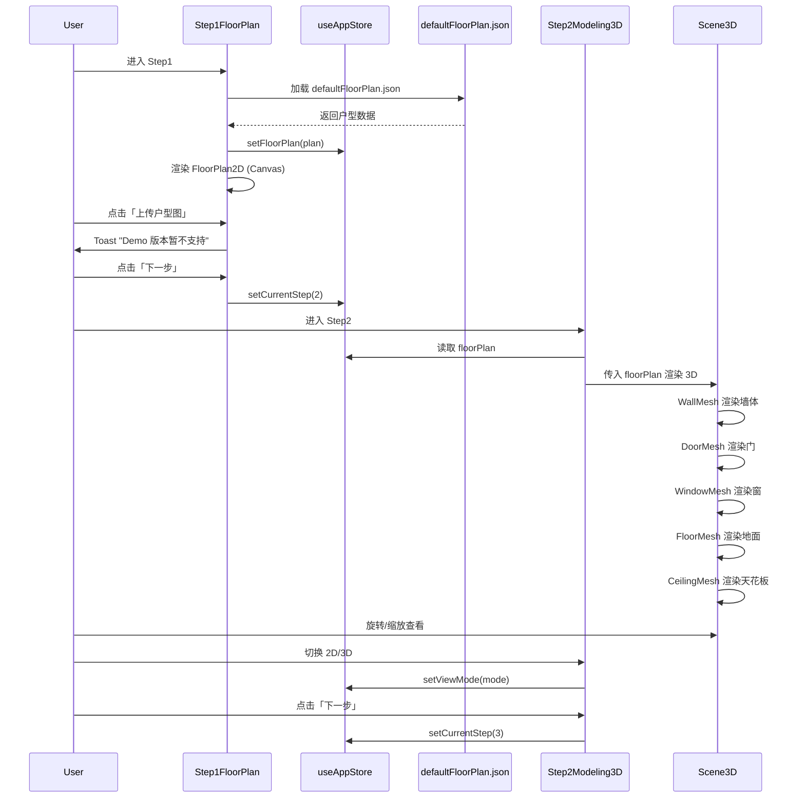
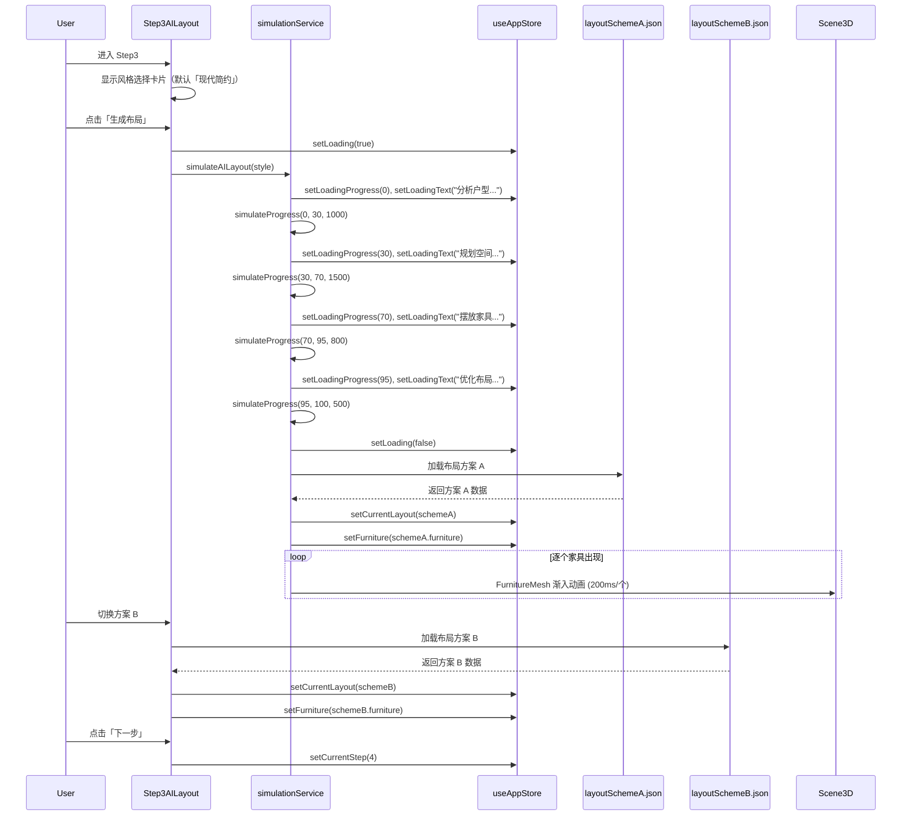
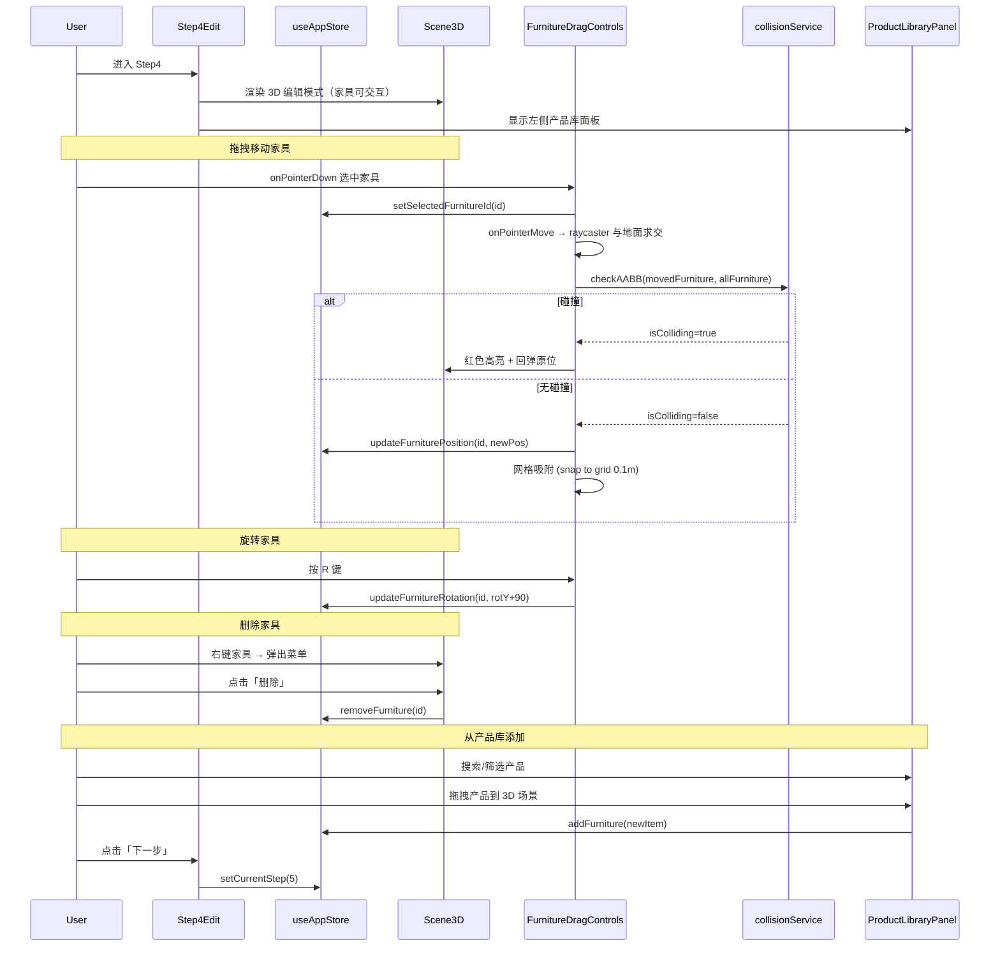
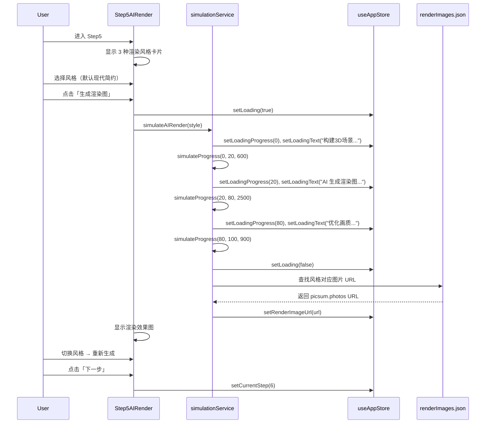
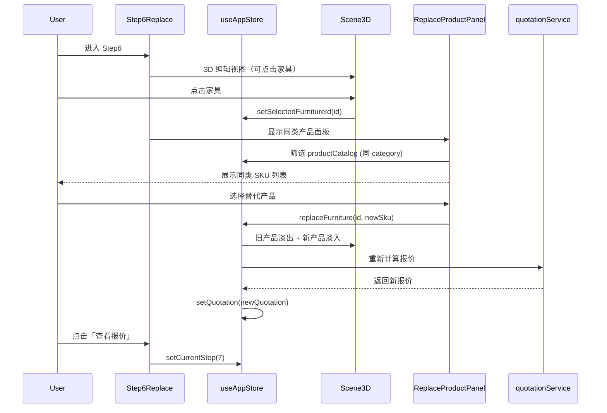
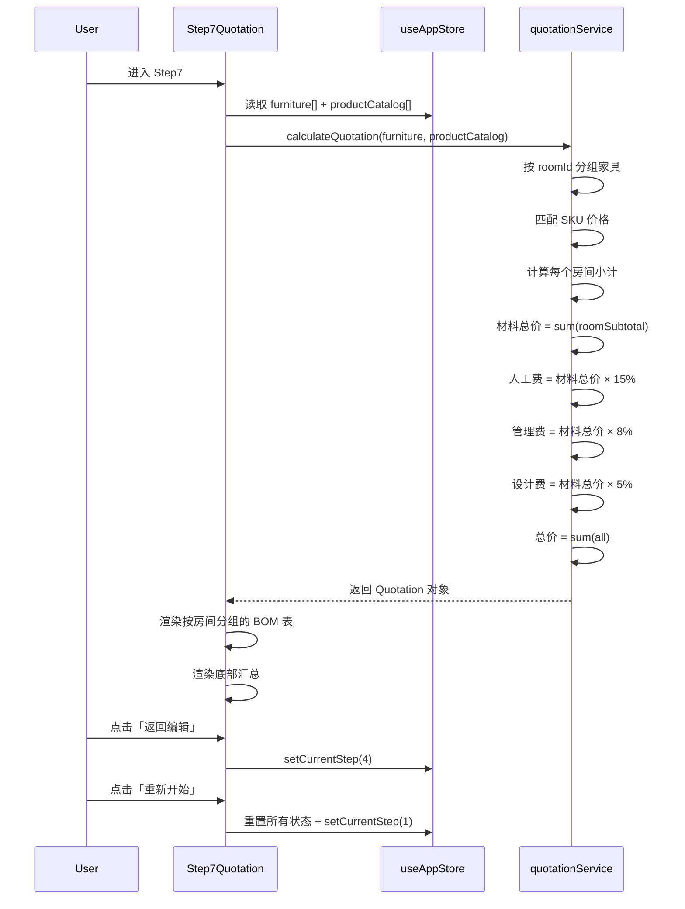
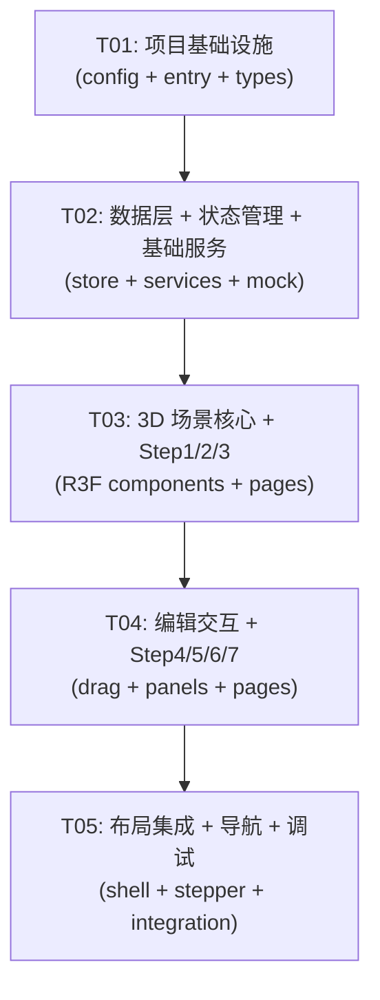

# AI 全自动室内设计平台 — 系统架构设计

> 版本：v1.0 | 更新日期：2025-07-12 | 架构师：高见远（Gao）

---

## 目录

1. [实现方案](#1-实现方案)
2. [文件列表](#2-文件列表)
3. [数据结构与接口](#3-数据结构与接口)
4. [程序调用流程](#4-程序调用流程)
5. [待明确事项](#5-待明确事项)
6. [依赖包列表](#6-依赖包列表)
7. [任务列表](#7-任务列表)
8. [共享知识](#8-共享知识)
9. [任务依赖图](#9-任务依赖图)

---

## 1. 实现方案

### 1.1 核心技术挑战

| 挑战 | 难度 | 解决策略 |
|------|------|----------|
| 户型 JSON → Three.js 3D 场景构建 | 高 | 声明式 React Three Fiber 组件，Wall/Door/Window/Room 分别为独立 R3F 组件，根据 JSON 数据渲染 BoxGeometry + 布尔裁剪 |
| 家具拖拽交互（3D → 2D 屏幕坐标映射） | 高 | 使用 @react-three/drei 的 useDrag 机制 + onPointerMove 事件，在 onPointerDown 时将 raycaster 与地面平面求交获取世界坐标 |
| AABB 碰撞检测 | 中 | 自行实现前端 AABB 碰撞检测引擎，在拖拽移动/放置时检测当前家具包围盒与所有其他家具包围盒是否重叠 |
| 7步全流程状态管理 | 中 | Zustand 单一 Store 管理全局状态，以 currentStep 驱动步骤切换，各步骤数据通过 Store 传递 |
| AI 模拟动画 | 中 | 统一 simulateProgress 工具函数，非线性进度条 + setTimeout 延迟加载预设数据 |
| 换品动画过渡 | 低 | CSS transition + R3F useSpring 处理 3D 模型替换时的 opacity 渐变 |

### 1.2 技术选型确认

| 领域 | 选型 | 理由 |
|------|------|------|
| 前端框架 | React 18 + TypeScript | 生态成熟，R3F 原生支持 |
| 构建工具 | Vite 5 | 快速 HMR，R3F 友好 |
| UI 组件库 | MUI v5 | 企业级组件，Stepper/Dialog/Menu 等开箱即用 |
| CSS 方案 | Tailwind CSS + MUI sx | Tailwind 用于布局/间距，MUI sx 用于主题样式 |
| 状态管理 | Zustand | 轻量、TypeScript 友好、支持中间件 |
| 3D 引擎 | Three.js + React Three Fiber | 声明式 3D，React 生态集成 |
| 3D 辅助 | @react-three/drei | 提供 OrbitControls/TransformControls/Html 等常用工具 |
| 3D 动画 | @react-spring/three | 物理动画，家具出现/替换过渡 |
| 碰撞检测 | 自实现 AABB | 简化版无需 cannon-es，前端计算即可 |
| 包管理 | pnpm | 快速、磁盘高效 |
| 部署 | Vercel / GitHub Pages | 纯静态部署，零后端 |

### 1.3 整体架构

```
┌──────────────────────────────────────────────────────────────┐
│                        App Shell                             │
│  ┌─────────┐  ┌──────────────────────────────────────────┐   │
│  │ Stepper │  │              Main Content Area           │   │
│  │  NavBar │  │  ┌────────────────────────────────────┐  │   │
│  │         │  │  │        Step Page Component          │  │   │
│  │ Step1-7 │  │  │  ┌──────────┐  ┌───────────────┐   │  │   │
│  │         │  │  │  │ 3D/R3F   │  │ Side Panel     │   │  │   │
│  │         │  │  │  │ Canvas   │  │ (Product Lib / │   │  │   │
│  │         │  │  │  │          │  │  Replace /     │   │  │   │
│  │         │  │  │  │          │  │  Properties)   │   │  │   │
│  │         │  │  │  └──────────┘  └───────────────┘   │  │   │
│  │         │  │  └────────────────────────────────────┘  │   │
│  └─────────┘  └──────────────────────────────────────────┘   │
└──────────────────────────────────────────────────────────────┘
```

**分层架构**：

```
┌─────────────────────────────────┐
│        Presentation Layer       │  ← React Components (Pages + Widgets)
├─────────────────────────────────┤
│         3D Scene Layer          │  ← React Three Fiber (Scene + Meshes)
├─────────────────────────────────┤
│        State Management         │  ← Zustand Store (useAppStore)
├─────────────────────────────────┤
│        Business Logic           │  ← Services (collision, quotation, simulation)
├─────────────────────────────────┤
│         Data Layer              │  ← Mock JSON + TypeScript Types
└─────────────────────────────────┘
```

### 1.4 数据流设计

```
Mock JSON ──→ Zustand Store ──→ React Components ──→ R3F Scene
                  ↑                    │
                  └── User Actions ────┘

关键数据流：
1. 户型数据流: defaultFloorPlan.json → store.floorPlan → FloorPlan2D + Scene3D
2. 布局数据流: layoutSchemeA/B.json → store.layoutFurniture → FurnitureMesh[]
3. 编辑数据流: 用户拖拽 → store.updateFurniturePosition → R3F 重新渲染
4. 碰撞数据流: store.furniture[] → collisionService.check() → 高亮/回弹反馈
5. 报价数据流: store.furniture[] + productCatalog → quotationService.calculate() → QuotationPage
6. 渲染数据流: renderImages.json → store.renderResult → RenderResultPage
```

---

## 2. 文件列表

### 2.1 项目根目录配置

| 文件路径 | 职责 |
|----------|------|
| `package.json` | 项目依赖声明、脚本命令 |
| `vite.config.ts` | Vite 构建配置（React 插件、路径别名） |
| `tsconfig.json` | TypeScript 编译配置 |
| `tsconfig.node.json` | Node 环境 TS 配置 |
| `tailwind.config.ts` | Tailwind CSS 配置（自定义颜色、间距） |
| `postcss.config.js` | PostCSS 配置（Tailwind + autoprefixer） |
| `index.html` | SPA 入口 HTML |
| `.gitignore` | Git 忽略规则 |

### 2.2 源码文件

```
src/
├── main.tsx                              # React 应用入口，挂载 App
├── App.tsx                               # 根组件：ThemeProvide + Router + Layout
├── vite-env.d.ts                         # Vite 类型声明
│
├── types/
│   └── index.ts                          # 全局 TypeScript 类型定义
│
├── store/
│   └── useAppStore.ts                    # Zustand 全局状态 Store
│
├── services/
│   ├── collisionService.ts              # AABB 碰撞检测服务
│   ├── quotationService.ts             # 报价计算服务
│   └── simulationService.ts            # AI 模拟进度服务
│
├── mock/
│   ├── defaultFloorPlan.json            # 默认户型数据
│   ├── layoutSchemeA.json               # 布局方案 A
│   ├── layoutSchemeB.json               # 布局方案 B
│   ├── productCatalog.json              # 产品库 SKU
│   ├── renderImages.json                # 渲染效果图 URL
│   └── quotationTemplate.json           # 报价模板
│
├── components/
│   ├── layout/
│   │   ├── AppShell.tsx                 # 应用外壳（顶栏+步骤条+内容区）
│   │   ├── StepNavBar.tsx               # 顶部步骤导航条
│   │   └── ProgressOverlay.tsx          # AI 进度遮罩层
│   │
│   ├── floorplan/
│   │   └── FloorPlan2D.tsx              # 2D 户型俯视图（Canvas）
│   │
│   ├── scene3d/
│   │   ├── Scene3D.tsx                  # 3D 场景容器（Canvas + Controls）
│   │   ├── WallMesh.tsx                 # 墙体 3D 网格
│   │   ├── DoorMesh.tsx                 # 门 3D 网格
│   │   ├── WindowMesh.tsx               # 窗户 3D 网格
│   │   ├── FloorMesh.tsx                # 地面 3D 网格
│   │   ├── CeilingMesh.tsx              # 天花板 3D 网格（可切换）
│   │   ├── FurnitureMesh.tsx            # 家具 3D 网格（Box + 颜色）
│   │   ├── FurnitureDragControls.tsx    # 家具拖拽控制
│   │   └── SceneContextMenu.tsx         # 3D 场景右键菜单
│   │
│   ├── panels/
│   │   ├── ProductLibraryPanel.tsx       # 左侧产品库面板
│   │   ├── FurniturePropertiesPanel.tsx  # 右侧家具属性面板
│   │   └── ReplaceProductPanel.tsx       # 右侧换品面板（Step6）
│   │
│   └── common/
│       ├── StepLayout.tsx               # 步骤页面布局模板
│       └── ToastDemo.tsx                # Demo 限制 Toast 提示
│
├── pages/
│   ├── Step1FloorPlan.tsx               # Step1 户型识别页
│   ├── Step2Modeling3D.tsx              # Step2 3D 建模页
│   ├── Step3AILayout.tsx                # Step3 AI 布局页
│   ├── Step4Edit.tsx                    # Step4 半自动编辑页
│   ├── Step5AIRender.tsx               # Step5 AI 渲染页
│   ├── Step6Replace.tsx                # Step6 换品页
│   └── Step7Quotation.tsx              # Step7 报价页
│
└── styles/
    └── theme.ts                         # MUI 主题 + Tailwind 自定义变量
```

---

## 3. 数据结构与接口

### 3.1 类图



### 3.2 TypeScript 类型定义

```typescript
// ==================== 基础类型 ====================

interface Point2D {
  x: number;
  y: number;
}

interface Point3D {
  x: number;
  y: number;
  z: number;
}

interface Size3D {
  width: number;  // 沿 X 轴
  depth: number;  // 沿 Y 轴
  height: number; // 沿 Z 轴（竖直向上）
}

// ==================== 户型相关 ====================

interface Wall {
  id: string;
  start: Point2D;
  end: Point2D;
  thickness: number;
  height: number;
}

interface Door {
  id: string;
  wallId: string;
  position: number; // 0-1, 门在墙体上的位置比例
  width: number;
  height: number;
  type: 'swing' | 'sliding' | 'pocket';
  direction: 'inward' | 'outward';
}

interface Window {
  id: string;
  wallId: string;
  position: number; // 0-1
  width: number;
  height: number;
  sillHeight: number;
}

interface Room {
  id: string;
  name: string;
  type: 'living_room' | 'master_bedroom' | 'second_bedroom' | 'kitchen' | 'bathroom' | 'balcony';
  floorPolygon: Point2D[];
  area: number;
  floorMaterial: string;
}

interface FloorPlan {
  id: string;
  name: string;
  totalArea: number;
  ceilingHeight: number;
  unit: string;
  origin: Point2D;
  walls: Wall[];
  doors: Door[];
  windows: Window[];
  rooms: Room[];
}

// ==================== 家具与布局 ====================

interface FurnitureInstance {
  id: string;
  roomId: string;
  skuId: string;
  name: string;
  position: Point3D;
  rotation: Point3D;
  size: Size3D;
}

interface LayoutScheme {
  id: string;
  name: string;
  style: string;
  floorPlanId: string;
  furniture: FurnitureInstance[];
}

// ==================== 产品库 ====================

interface ProductSKU {
  id: string;
  name: string;
  category: string;
  subCategory: string;
  brand: string;
  style: string[];
  size: Size3D;
  color: string;
  material: string;
  price: number;
  unit: string;
  imageUrl: string;
  modelColor: string;
}

// ==================== 报价 ====================

interface QuotationItem {
  furnitureId: string;
  skuId: string;
  name: string;
  quantity: number;
  unitPrice: number;
  subtotal: number;
}

interface QuotationRoom {
  roomId: string;
  roomName: string;
  items: QuotationItem[];
  roomSubtotal: number;
}

interface QuotationSummary {
  materialTotal: number;
  laborFee: number;
  managementFee: number;
  designFee: number;
  grandTotal: number;
}

interface Quotation {
  id: string;
  name: string;
  layoutSchemeId: string;
  createdAt: string;
  laborRate: number;
  managementFeeRate: number;
  designFeeRate: number;
  rooms: QuotationRoom[];
  summary: QuotationSummary;
}

// ==================== 渲染 ====================

interface RenderStyle {
  id: string;
  name: string;
  imageUrl: string;
}

// ==================== 碰撞检测 ====================

interface AABB {
  minX: number;
  maxX: number;
  minY: number;
  maxY: number;
}

interface CollisionResult {
  isColliding: boolean;
  collidingWith: string[]; // furniture IDs
}

// ==================== App 状态 ====================

type ViewMode = '2d' | '3d';
type StepNumber = 1 | 2 | 3 | 4 | 5 | 6 | 7;

interface AppState {
  // 步骤控制
  currentStep: StepNumber;
  
  // 户型数据
  floorPlan: FloorPlan | null;
  
  // 布局数据
  currentLayout: LayoutScheme | null;
  furniture: FurnitureInstance[];
  selectedFurnitureId: string | null;
  
  // 产品库
  productCatalog: ProductSKU[];
  
  // 3D 场景控制
  showCeiling: boolean;
  viewMode: ViewMode;
  
  // 报价
  quotation: Quotation | null;
  
  // AI 渲染
  renderStyles: RenderStyle[];
  selectedRenderStyle: string;
  renderImageUrl: string | null;
  
  // 加载状态
  isLoading: boolean;
  loadingProgress: number;
  loadingText: string;
  
  // Actions
  setCurrentStep: (step: StepNumber) => void;
  setFloorPlan: (plan: FloorPlan) => void;
  setCurrentLayout: (layout: LayoutScheme) => void;
  setFurniture: (furniture: FurnitureInstance[]) => void;
  addFurniture: (item: FurnitureInstance) => void;
  updateFurniturePosition: (id: string, position: Point3D) => void;
  updateFurnitureRotation: (id: string, rotation: Point3D) => void;
  removeFurniture: (id: string) => void;
  replaceFurniture: (id: string, newSku: ProductSKU) => void;
  setSelectedFurnitureId: (id: string | null) => void;
  setShowCeiling: (show: boolean) => void;
  setViewMode: (mode: ViewMode) => void;
  setQuotation: (q: Quotation) => void;
  setLoading: (loading: boolean) => void;
  setLoadingProgress: (progress: number) => void;
  setLoadingText: (text: string) => void;
  setRenderImageUrl: (url: string | null) => void;
  setSelectedRenderStyle: (style: string) => void;
}
```

---

## 4. 程序调用流程

### 4.1 Step1 户型识别 → Step2 3D 建模



### 4.2 Step3 AI 布局



### 4.3 Step4 半自动编辑



### 4.4 Step5 AI 渲染



### 4.5 Step6 换品



### 4.6 Step7 报价



---

## 5. 待明确事项

| # | 事项 | 当前假设 | 备注 |
|---|------|----------|------|
| 1 | 3D 家具模型是否仅用 BoxGeometry 简单立方体？ | 是，使用 BoxGeometry + modelColor 材质 | Demo 版本简化，后续可换 GLTF |
| 2 | 网格吸附间距 | 0.1m (10cm) | 可后续调整 |
| 3 | 右键菜单「替换」与 Step6 换品的关系 | Step4 右键「替换」打开产品库面板选择，Step6 专注同类换品 | 两种入口到同一功能 |
| 4 | 2D 户型视图技术选型 | Canvas 2D API | SVG 也可以，Canvas 在后续交互扩展更灵活 |
| 5 | 步骤间是否可以回退？ | 仅 Step4/5/6 可自由切换，其余只能前进 | 按 PRD 8.2 节 |
| 6 | 换品后位置是否保留？ | 是，保持原位置，仅更新模型和尺寸 | 按 PRD Step6 说明 |
| 7 | 多件家具同时碰撞检测的性能 | 家具数量 ≤ 50 件，O(n²) 可接受 | Demo 场景无性能瓶颈 |
| 8 | 门在 3D 场景中的渲染方式 | 在墙体对应位置开洞（简化：用不同颜色标识门的区域） | 真正的 CSG 布尔运算较复杂，Demo 用颜色区分 |

---

## 6. 依赖包列表

### 6.1 生产依赖

```json
{
  "dependencies": {
    "react": "^18.2.0",
    "react-dom": "^18.2.0",
    "@mui/material": "^5.15.0",
    "@mui/icons-material": "^5.15.0",
    "@emotion/react": "^11.11.0",
    "@emotion/styled": "^11.11.0",
    "three": "^0.162.0",
    "@react-three/fiber": "^8.15.0",
    "@react-three/drei": "^9.99.0",
    "@react-spring/three": "^9.7.3",
    "zustand": "^4.5.0"
  }
}
```

### 6.2 开发依赖

```json
{
  "devDependencies": {
    "@types/react": "^18.2.0",
    "@types/react-dom": "^18.2.0",
    "@types/three": "^0.162.0",
    "@vitejs/plugin-react": "^4.2.0",
    "typescript": "^5.3.0",
    "vite": "^5.1.0",
    "tailwindcss": "^3.4.0",
    "postcss": "^8.4.0",
    "autoprefixer": "^10.4.0"
  }
}
```

---

## 7. 任务列表

### T01: 项目基础设施

| 字段 | 内容 |
|------|------|
| **任务编号** | T01 |
| **任务名称** | 项目基础设施 |
| **涉及文件** | `package.json`, `vite.config.ts`, `tsconfig.json`, `tsconfig.node.json`, `tailwind.config.ts`, `postcss.config.js`, `index.html`, `.gitignore`, `src/main.tsx`, `src/App.tsx`, `src/vite-env.d.ts`, `src/styles/theme.ts`, `src/types/index.ts` |
| **依赖任务** | 无 |
| **优先级** | P0 |
| **复杂度** | M |

**详细说明**：
- 初始化 pnpm 项目，安装所有依赖
- 配置 Vite（React 插件、路径别名 `@/` → `src/`）
- 配置 TypeScript（strict 模式、路径映射）
- 配置 Tailwind CSS（自定义颜色变量对齐 MUI 主题）
- 配置 MUI 主题（自定义调色板、字体、间距）
- 创建 App.tsx 根组件：MUI ThemeProvider + CssBaseline + 布局结构
- 定义全部 TypeScript 类型（types/index.ts）

---

### T02: 数据层 + 状态管理 + 基础服务

| 字段 | 内容 |
|------|------|
| **任务编号** | T02 |
| **任务名称** | 数据层 + 状态管理 + 基础服务 |
| **涉及文件** | `src/store/useAppStore.ts`, `src/services/collisionService.ts`, `src/services/quotationService.ts`, `src/services/simulationService.ts`, `src/mock/defaultFloorPlan.json`, `src/mock/layoutSchemeA.json`, `src/mock/layoutSchemeB.json`, `src/mock/productCatalog.json`, `src/mock/renderImages.json`, `src/mock/quotationTemplate.json` |
| **依赖任务** | T01 |
| **优先级** | P0 |
| **复杂度** | L |

**详细说明**：
- 创建全部 6 个 Mock JSON 数据文件（从 PRD 复制数据）
- 实现 Zustand Store：定义所有 state + actions（含 Immer 中间件简化不可变更新）
- 实现 collisionService.ts：AABB 包围盒计算、碰撞检测、网格吸附
- 实现 quotationService.ts：按房间分组、价格匹配、费用计算（材料总价 + 人工费15% + 管理费8% + 设计费5%）
- 实现 simulationService.ts：simulateProgress 非线性进度、simulateAILayout、simulateAIRender

---

### T03: 3D 场景核心 + Step1/2/3 页面

| 字段 | 内容 |
|------|------|
| **任务编号** | T03 |
| **任务名称** | 3D 场景核心 + Step1/2/3 页面 |
| **涉及文件** | `src/components/scene3d/Scene3D.tsx`, `src/components/scene3d/WallMesh.tsx`, `src/components/scene3d/DoorMesh.tsx`, `src/components/scene3d/WindowMesh.tsx`, `src/components/scene3d/FloorMesh.tsx`, `src/components/scene3d/CeilingMesh.tsx`, `src/components/scene3d/FurnitureMesh.tsx`, `src/components/floorplan/FloorPlan2D.tsx`, `src/pages/Step1FloorPlan.tsx`, `src/pages/Step2Modeling3D.tsx`, `src/pages/Step3AILayout.tsx`, `src/components/layout/ProgressOverlay.tsx` |
| **依赖任务** | T02 |
| **优先级** | P0 |
| **复杂度** | L |

**详细说明**：
- 实现 Scene3D 容器：R3F Canvas + OrbitControls + 灯光 + 相机
- 实现 WallMesh：根据 Wall 数据渲染 BoxGeometry 墙体（厚度、高度）
- 实现 DoorMesh：在墙体对应位置渲染门（不同颜色标识）
- 实现 WindowMesh：在墙体对应位置渲染窗户（半透明材质）
- 实现 FloorMesh：根据 Room.floorPolygon 渲染地面（ExtrudeGeometry 或 ShapeGeometry）
- 实现 CeilingMesh：可切换显示/隐藏的顶面
- 实现 FurnitureMesh：根据 FurnitureInstance 渲染 Box + modelColor + 选中高亮
- 实现 FloorPlan2D：Canvas 2D 俯视图绘制户型轮廓
- 实现 Step1FloorPlan 页面：加载默认户型 + 2D 展示 + 上传按钮 toast
- 实现 Step2Modeling3D 页面：3D 场景渲染 + 2D/3D 切换 + 天花板切换
- 实现 Step3AILayout 页面：风格选择 + 生成按钮 + 进度遮罩 + 家具逐个动画
- 实现 ProgressOverlay：AI 进度遮罩层（进度条 + 文字）

---

### T04: 编辑交互 + Step4/5/6/7 页面 + 面板组件

| 字段 | 内容 |
|------|------|
| **任务编号** | T04 |
| **任务名称** | 编辑交互 + Step4/5/6/7 页面 + 面板组件 |
| **涉及文件** | `src/components/scene3d/FurnitureDragControls.tsx`, `src/components/scene3d/SceneContextMenu.tsx`, `src/components/panels/ProductLibraryPanel.tsx`, `src/components/panels/FurniturePropertiesPanel.tsx`, `src/components/panels/ReplaceProductPanel.tsx`, `src/pages/Step4Edit.tsx`, `src/pages/Step5AIRender.tsx`, `src/pages/Step6Replace.tsx`, `src/pages/Step7Quotation.tsx` |
| **依赖任务** | T03 |
| **优先级** | P0 |
| **复杂度** | L |

**详细说明**：
- 实现 FurnitureDragControls：onPointerDown 选中 → onPointerMove raycaster 求交 → 碰撞检测 → 网格吸附 → 更新 Store
- 实现 SceneContextMenu：右键菜单（删除/替换/查看详情），使用 MUI Menu
- 实现 ProductLibraryPanel：分类筛选 + 搜索 + 产品列表 + 拖拽到场景
- 实现 FurniturePropertiesPanel：选中家具的属性展示
- 实现 ReplaceProductPanel：同类产品列表 + 选择替换
- 实现 Step4Edit：3D 编辑模式 + 左侧面板 + 右键菜单 + 碰撞反馈
- 实现 Step5AIRender：风格选择 + 生成按钮 + 进度条 + 渲染图展示
- 实现 Step6Replace：点击家具 + 右侧换品面板 + 替换动画 + 报价实时更新
- 实现 Step7Quotation：按房间分组 BOM + 汇总 + 返回编辑/重新开始按钮

---

### T05: 布局集成 + 导航 + 最终调试

| 字段 | 内容 |
|------|------|
| **任务编号** | T05 |
| **任务名称** | 布局集成 + 导航 + 最终调试 |
| **涉及文件** | `src/components/layout/AppShell.tsx`, `src/components/layout/StepNavBar.tsx`, `src/components/common/StepLayout.tsx`, `src/components/common/ToastDemo.tsx`, `src/App.tsx`（更新） |
| **依赖任务** | T04 |
| **优先级** | P1 |
| **复杂度** | M |

**详细说明**：
- 实现 AppShell：顶栏 + 侧边区域 + 主内容区布局
- 实现 StepNavBar：MUI Stepper 步骤条，当前步骤高亮，已完成步骤可点击回退（Step4/5/6）
- 实现 StepLayout：统一页面布局模板（标题 + 内容 + 底部操作栏）
- 实现 ToastDemo：封装 MUI Snackbar，用于 Demo 版本限制提示
- 更新 App.tsx：根据 currentStep 渲染对应 Step 页面
- 全流程联调：Step1 → Step7 完整流程走通
- 修复集成问题：数据传递、状态同步、3D 场景切换等

---

## 8. 共享知识

### 8.1 CSS 变量 / 主题体系

```typescript
// MUI 主题色
const theme = createTheme({
  palette: {
    primary: { main: '#1976d2' },      // 主色-蓝
    secondary: { main: '#9c27b0' },     // 辅色-紫
    error: { main: '#d32f2f' },         // 错误-红（碰撞提示）
    success: { main: '#2e7d32' },       // 成功-绿
    warning: { main: '#ed6c02' },       // 警告-橙
    background: { default: '#f5f5f5' }, // 页面背景
  },
  typography: {
    fontFamily: '"Roboto", "Noto Sans SC", sans-serif',
  },
});
```

```css
/* Tailwind 自定义扩展 */
/* tailwind.config.ts 中 extend */
colors: {
  primary: '#1976d2',
  '3d-bg': '#e8e8e8',      /* 3D 视图区域背景 */
  'panel-bg': '#fafafa',    /* 侧面板背景 */
  'furniture-highlight': '#ff9800',  /* 家具选中高亮 */
  'collision-error': '#d32f2f',      /* 碰撞错误 */
}
```

### 8.2 3D 场景坐标系约定

```
Three.js 坐标系（Y-up）：
- X 轴：水平方向（对应户型 JSON 中的 x）
- Y 轴：竖直方向（高度，0=地面）
- Z 轴：深度方向（对应户型 JSON 中的 y）

映射关系：
- 户型 JSON (x, y) → Three.js (x, 0, y)
- 家具 position.z 在 JSON 中 = 0 → Three.js 中 y=0（地面上）
- 家具旋转 rotation.y → Three.js 中绕 Y 轴旋转

单位：全部使用米(m)作为 3D 场景单位
网格吸附：0.1m (10cm)
```

### 8.3 组件命名规范

| 规范 | 示例 |
|------|------|
| 页面组件：Step{N}{功能} | `Step1FloorPlan`, `Step4Edit` |
| 3D 组件：{实体}Mesh | `WallMesh`, `FurnitureMesh` |
| 面板组件：{功能}Panel | `ProductLibraryPanel` |
| 布局组件：{功能} | `AppShell`, `StepNavBar` |
| Service：{功能}Service | `collisionService`, `quotationService` |
| Store：use{Name}Store | `useAppStore` |
| 类型：PascalCase | `FloorPlan`, `FurnitureInstance` |
| Mock 数据文件：camelCase | `defaultFloorPlan.json` |

### 8.4 Mock 数据使用规范

- 所有 Mock JSON 放在 `src/mock/` 目录下
- 通过 `import data from '@/mock/xxx.json'` 直接导入，Vite 自动处理 JSON
- Mock 数据格式必须与 TypeScript 类型定义完全一致
- 禁止在组件中硬编码数据，统一从 Mock 文件或 Store 读取
- picsum.photos URL 用 seed 参数确保每次加载同一张图

### 8.5 状态管理规范

- Zustand Store 为单一全局 Store（useAppStore）
- 组件通过 `useAppStore(state => state.xxx)` 选择性订阅，避免不必要渲染
- Actions 命名：set + 名词（如 `setFloorPlan`）或 动词 + 名词（如 `addFurniture`）
- 禁止在 Store 之外直接修改状态，所有状态变更通过 Store actions

### 8.6 碰撞检测规范

- AABB 计算基于家具的 position + size（考虑旋转后的包围盒）
- 碰撞检测时机：拖拽移动时实时检测，放下时最终判定
- 碰撞反馈：家具材质变红 + 0.5s 闪烁动画 → 弹回原位
- 墙体碰撞：额外检测家具是否超出房间边界

---

## 9. 任务依赖图



**关键路径**：T01 → T02 → T03 → T04 → T05

---

## 附录 A：3D 家具模型映射

Demo 版本使用 BoxGeometry 简单立方体表示家具，通过 `modelColor` 区分类型：

| 家具类型 | 几何形态 | modelColor 示例 |
|----------|----------|-----------------|
| 沙发 | 扁平方块 | #8B8682（浅灰） |
| 床 | 扁平长方块 | #DEB887（原木色） |
| 衣柜 | 高窄长方块 | #F5F5F5（白色） |
| 桌子 | 薄方块+桌腿 | #F0F0F0（白色） |
| 椅子 | 小方块 | #333333（黑色） |
| 冰箱 | 高方块 | #C0C0C0（银色） |
| 马桶 | 小矮方块 | #FFFFFF（白色） |
| 灯具 | 细高方块 | #333333 / #F5F5F5 |
| 地毯 | 极薄方块 (height=0.02) | #B0B0B0（灰） |

## 附录 B：碰撞检测伪代码

```typescript
function computeAABB(furniture: FurnitureInstance): AABB {
  const { position, size, rotation } = furniture;
  const rotY = rotation.y * (Math.PI / 180);
  
  // 旋转后的宽深
  const cosR = Math.abs(Math.cos(rotY));
  const sinR = Math.abs(Math.sin(rotY));
  const rotatedWidth = size.width * cosR + size.depth * sinR;
  const rotatedDepth = size.width * sinR + size.depth * cosR;
  
  return {
    minX: position.x - rotatedWidth / 2,
    maxX: position.x + rotatedWidth / 2,
    minY: position.y - rotatedDepth / 2,  // 注意：3D 中对应 Z 轴
    maxY: position.y + rotatedDepth / 2,
  };
}

function checkAABBOverlap(a: AABB, b: AABB): boolean {
  return a.minX < b.maxX && a.maxX > b.minX &&
         a.minY < b.maxY && a.maxY > b.minY;
}

function detectCollisions(
  targetId: string,
  allFurniture: FurnitureInstance[]
): CollisionResult {
  const target = allFurniture.find(f => f.id === targetId);
  if (!target) return { isColliding: false, collidingWith: [] };
  
  const targetAABB = computeAABB(target);
  const collidingWith: string[] = [];
  
  for (const f of allFurniture) {
    if (f.id === targetId) continue;
    const fAABB = computeAABB(f);
    if (checkAABBOverlap(targetAABB, fAABB)) {
      collidingWith.push(f.id);
    }
  }
  
  return {
    isColliding: collidingWith.length > 0,
    collidingWith,
  };
}
```

## 附录 C：报价计算伪代码

```typescript
function calculateQuotation(
  furniture: FurnitureInstance[],
  productCatalog: ProductSKU[],
  laborRate: number = 0.15,
  managementFeeRate: number = 0.08,
  designFeeRate: number = 0.05,
): Quotation {
  // 1. 构建 SKU 查找表
  const skuMap = new Map(productCatalog.map(s => [s.id, s]));
  
  // 2. 按房间分组
  const roomsMap = new Map<string, FurnitureInstance[]>();
  for (const f of furniture) {
    if (!roomsMap.has(f.roomId)) roomsMap.set(f.roomId, []);
    roomsMap.get(f.roomId)!.push(f);
  }
  
  // 3. 计算每个房间
  const rooms: QuotationRoom[] = [];
  let materialTotal = 0;
  
  for (const [roomId, items] of roomsMap) {
    const quotationItems: QuotationItem[] = items.map(f => {
      const sku = skuMap.get(f.skuId)!;
      return {
        furnitureId: f.id,
        skuId: f.skuId,
        name: f.name,
        quantity: 1,
        unitPrice: sku.price,
        subtotal: sku.price,
      };
    });
    const roomSubtotal = quotationItems.reduce((s, i) => s + i.subtotal, 0);
    materialTotal += roomSubtotal;
    rooms.push({ roomId, roomName: '', items: quotationItems, roomSubtotal });
  }
  
  // 4. 计算汇总
  const laborFee = Math.round(materialTotal * laborRate);
  const managementFee = Math.round(materialTotal * managementFeeRate);
  const designFee = Math.round(materialTotal * designFeeRate);
  const grandTotal = materialTotal + laborFee + managementFee + designFee;
  
  return {
    id: `quotation_${Date.now()}`,
    name: '全屋报价单',
    layoutSchemeId: '',
    createdAt: new Date().toISOString(),
    laborRate,
    managementFeeRate,
    designFeeRate,
    rooms,
    summary: { materialTotal, laborFee, managementFee, designFee, grandTotal },
  };
}
```
